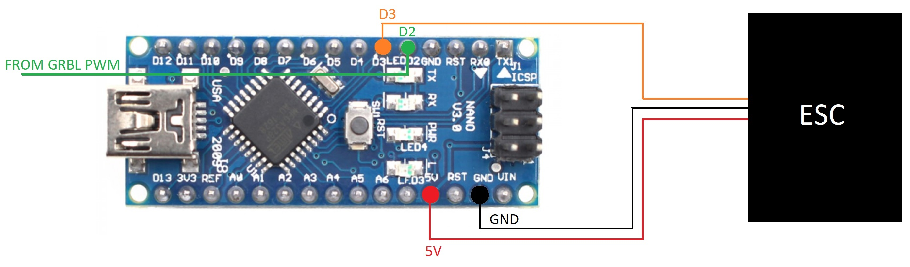

# grbl-rc-pwm

The spindle-control PWM signal coming out of GRBL has saturation between 0% and 100% which is perfect for most lasers, motors etc.

If you want to use a RC-style Brushless motor with an ESC for a custom-built spindle, it requires a different type of PWM signal.
The PWM controlling those has a pulse length of 0.5~2.5ms.

This project uses a cheap `Arduino Nano` to convert the 0-100% PWM coming out of GRBL to a PWM, that can control your RC Brushless motor.

It uses [Servo lib](https://github.com/arduino-libraries/Servo).

## Pinout

Here's how to connect it. This schematic assumes that you have common GND for both GRBL arduino and the `Arduino Nano` used for this conversion:



## Build & upload

To make it easaly use `Makefile`.

```bash
make upload
```
